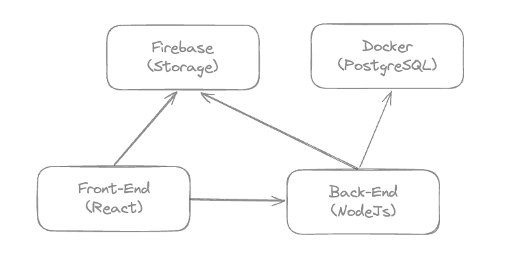

# myFronts.dev



Reference: [NLW Spacetime Aula 3:](https://github.com/rocketseat-education/nlw-12-spacetime-ignite)


## Running Guide

### Web
```
npm install
npm run dev
```


### Server
```
npm install
npm run dev
```


## References

### Documentation
- [Neon](https://neon.tech/docs/introduction)
- [Prisma](https://www.prisma.io/docs)
- [React Router Dom](https://reactrouter.com/)
- [date-fns](https://date-fns.org/)
- [jwt-decode](https://github.com/auth0/jwt-decode)
- [uuid](https://github.com/uuidjs/uuid)
- [firebase-storage](https://firebase.google.com/docs/storage?hl=pt-br)
- [JWT utils for Fastify](https://github.com/fastify/fastify-jwt)

### Content
- [NLW Spacetime: Rocketseat](https://github.com/rocketseat-education/nlw-12-spacetime-ignite)
- [Como sair do ZERO em Node.js em apenas UMA aula: Rocketseat](https://www.youtube.com/watch?v=hHM-hr9q4mo)
- [How to get parameter value from query string?](https://stackoverflow.com/questions/35352638/how-to-get-parameter-value-from-query-string)
- [ignite-nodejs-03-api-solid-nodejs](https://github.com/rocketseat-education/ignite-nodejs-03-api-solid-nodejs)
- [Princípios SOLID em uma API REST com Node.js e TypeScript | Code/Drops #44](https://www.youtube.com/watch?v=vAV4Vy4jfkc)
- [react-cookie](https://github.com/bendotcodes/cookies/tree/main/packages/react-cookie)
- [Setting and Using Cookies in React](https://clerk.com/blog/setting-and-using-cookies-in-react?utm_source=www.google.com&utm_medium=referral&utm_campaign=none)
- [ChatGPT](https://chat.openai.com/)
- [Bard](https://bard.google.com/)
- [React Js com TypeScript do zero ao avançado na pratica: Matheus Fraga](https://www.udemy.com/course/react-js-typescript/)
- [Estratégias de autenticação, JWT, OAuth, qual usar? | Podcast FalaDev #21](https://www.youtube.com/watch?v=mZrt5R9eZzM)
- [How to set up Prisma with a local Docker Postgres container](https://medium.com/nerd-for-tech/how-to-set-up-prisma-with-a-local-docker-postgres-container-9e0958d08544)
- [criando back-end de um app de upload (node, typescript, prisma, cloudflare)](https://www.twitch.tv/videos/2030389139)

### UI
- [NextJs](https://nextjs.org/)
- [Shadcn-UI](https://ui.shadcn.com/)
- [TailwindCSS Colors](https://tailwindcss.com/docs/customizing-colors)
- [Rocketseat](https://rocketseat.com.br)
- [LinkedIN](https://rocketseat.com.br)
- [Bootstrap Icons](https://icons.getbootstrap.com/)
- [Medium](https://medium.com/)
- [Notion](https://www.notion.so)
- [GitHub](https://github.com)